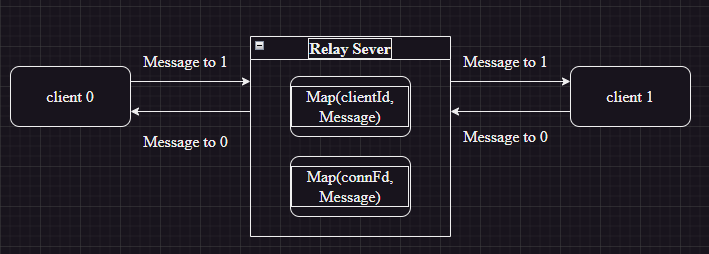
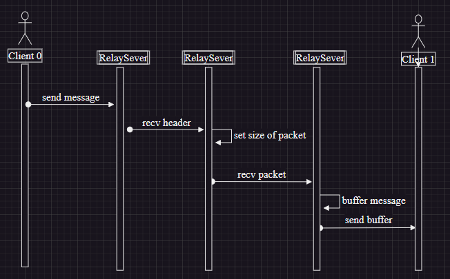
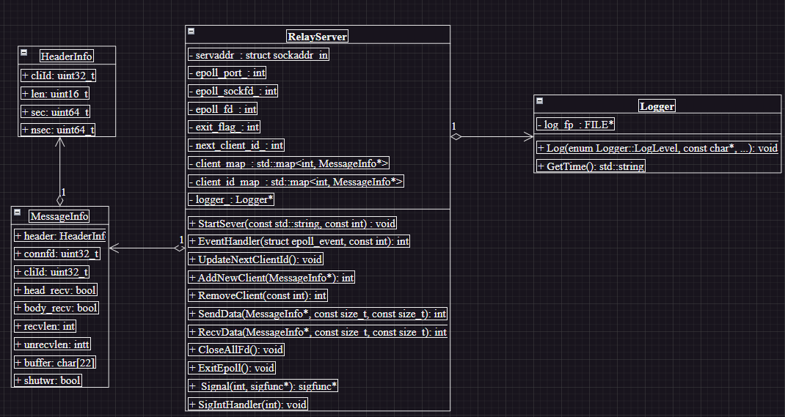

# 网络中继服务器
## RelayServer
### 功能描述
- 两个客户端与服务器相连，然后服务器将要**发送的消息与客户端编号以及对应的可连接文件描述符**记录下来；由服务器进行消息的转发
- 如果此时要发送的客户端并没有连接，抛弃报文，并向发送方发送“对方不存在”的出错报文。 
- 每个客户端连接有个整数ID，ID为n 和ID为n+1（n为偶数）的两个连接为一个会话

- client0、client1与服务器建立连接后，client0向client1发送消息：Server接收消息头部并设置需要接收报文体的长度，继续接收client0的报文体并缓存在Server中；寻找client1的已连接文件描述符，发送缓存的消息并清除Server中的缓存，结束一次发送、接收报文的流程。

### RelayServer设计
#### HeaderInfo
- 客户端之间传递报文的报文头
- `cliId`是客户端自身ID，`len`是发送报文(不包含头部)的大小，`sec`和`nsec`记录报文发送的秒数和纳秒数

#### MessageInfo
- 服务器内部为每个客户端维护的报文信息
- `header`是网络传输的报文头；`connfd`是客户端与服务器建立的已连接描述符；`cliId`是系统分配的客户端编号；`shutwr`是标记客户端是否已经关闭写端；`head_recv`是标记是否报文头已经读取完毕；`body_recv`是标记报文体是否已经读取完；`recvlen`是标记当前已经读取的长度(非阻塞可能不能将报文一次性传到对端)；`unrecvlen`是标记当前还未接收的报文长度；`buffer`是对客户端传递报文体的缓存

#### Logger
- 日志类，用于记录发生事件

#### RelayServer
- 使用`epoll`监听，使用非阻塞accept监听未连接文件描述符；并将分配的**已连接描述符设置为非阻塞**
##### 成员变量
~~~c++
  struct sockaddr_in servaddr_;             // epoll服务器地址
  int epoll_port_;                          // 服务器端口
  int epoll_sockfd_;                        // epoll接收连接fd
  int epoll_fd_;                            // epoll创建的fd
  static int exit_flag_;                    // 退出标志
  size_t next_client_id_ = 0;               // 下一个客户端ID
  std::map<int, MessageInfo*> client_map_;  // 客户端connfd与MessageInfo的映射
  std::map<int, MessageInfo*> client_id_map_;  // 客户端ID与MessageInfo的映射
  Logger* logger_;                             // 日志
~~~
##### 重要成员函数
- RecvData：缓存客户端发送的报文；由于文件描述符设置为非阻塞，我们需要考虑到报文可能不能一次发送成功或者发生年报，所以我们在`MessageInfo`中设置了诸多标志确保可以正确接收发送的报文。
  - 使用无限循环，当且仅当此次传输的消息均被接收跳出循环。
  - `unrecvlen`初始设置为头部长度，完全接收头部后，修改为报文体长度；接收到全部报文体再次修改为头部长度

  ~~~c++
  for (;;) {
    if (ret >= msg->unrecvlen) {
      if (!msg->head_recv) {
        /*
          接收头部，将未接收的报文长度设置为报文长度
        */
        msg->head_recv = true;
        // 解析头部数据，获取报文体长度
        uint32_t header_cliID = msg->header.cliId;
        memcpy(&msg->header + HEADERSZ - msg->unrecvlen,
                msg->buffer + msg->recvlen, msg->unrecvlen);
        auto res = ParseHeader(&msg->header, id);
        uint16_t connetlen = res.first;
        msg->header.cliId = header_cliID;
        msg->header.len = connetlen;
        logger_->Log(
            Logger::INFO,
            "RelayServer:\tClient %d recv header: len %d, cliId %d\n", id,
            connetlen, header_cliID);

        ret = ret - msg->unrecvlen;
        msg->recvlen += msg->unrecvlen;
        msg->unrecvlen = connetlen;
      } else {
        /*
          接收报文体，将未接收的报文长度变为头部大小
        */
        ret = ret - msg->unrecvlen;
        msg->recvlen += msg->unrecvlen;
        msg->unrecvlen = HEADERSZ;
        msg->head_recv = false;
        // break;
      }
    } else {
      /*
        部分接收
      */
      if (!msg->head_recv) {
        memcpy(&msg->header + HEADERSZ - msg->unrecvlen,
                msg->buffer + msg->recvlen, ret);
      }
      msg->recvlen += ret;
      msg->unrecvlen -= ret;
      break;
    }
  }
  ~~~

- SendData：将缓存客户端的消息发送到对端客户端；然后将报文从缓冲区中删除
  ~~~c++
  int RelayServer::SendData(MessageInfo *msg, const size_t &id,
                          const size_t &fd) {
    int ret = send(fd, msg->buffer, msg->recvlen, 0);
    if (ret < 0) {
      if (errno != EWOULDBLOCK) {
        RemoveClient(fd);
        logger_->Log(Logger::ERROR,
                    "RelayServer:\tSEND ERROR: server send to client %d error\n",
                    id);
        return -1;
      } else {
        logger_->Log(Logger::ERROR,
                    "RelayServer:\tNO SPACE ERROR: server has no spacesend to "
                    "client %d error\n",
                    id);
      }
    } else if (ret >= 0) {
      /*
        发送成功，将发送的报文从缓冲区中删除，将整个缓冲区前移
      */
      memcpy(msg->buffer, msg->buffer + ret, msg->recvlen - ret);
      msg->recvlen -= ret;
    }
    return ret;
  }
  ~~~
- EventsHandler：监听发生事件的套接字 
  - 未连接套接字，使用非阻塞accept接收；向epoll中注册新的新client
  - 可读事件：RecvData
  - 可写事件：SendData
  ~~~c++
  int RelayServer::EventsHandler(struct epoll_event *events, const int &nready) {
    for (int i = 0; i < nready; ++i) {
      int sockfd = events[i].data.fd;
      if (sockfd == epoll_sockfd_) {
        /*
          有新的连接
        */
        struct sockaddr_in clientaddr;
        socklen_t len = sizeof(clientaddr);

        // 非阻塞accept，直到connfd返回-1才结束
        for (;;) {
          int connfd =
              accept(epoll_sockfd_, (struct sockaddr *)&clientaddr, &len);
          if (connfd == -1) {
            if ((errno == ECONNABORTED) || (errno == EWOULDBLOCK) ||
                (errno == EINTR) || (errno == EPROTO)) {
              // 已经处理完全部连接
              break;
            } else {
              // 其他错误
              logger_->Log(Logger::ERROR,
                          "RelayServer:\tACCEPT ERROR: exit with error\n");
              return -1;
            }
          }
          /*
            声明一个新的客户端，连接描述符为connfd
          */
          MessageInfo *client = new MessageInfo;
          client->connfd = connfd;
          /*
            设置connfd为非阻塞
          */
          SetNonBlocking(connfd);
          /*
            向服务器添加新的客户端
          */
          AddNewClient(client);
        }

      } else {
        /*
          已连接套接字
        */
        ASSERT(client_map_.find(sockfd) != client_map_.end());
        int cur_client = client_map_[sockfd]->header.cliId;
        MessageInfo *cur_client_msg = client_map_[sockfd];
        int dst_client = GetDstId(cur_client);

        MessageInfo *dst_client_msg = nullptr;
        if (client_id_map_.find(dst_client) != client_id_map_.end()) {
          dst_client_msg = client_id_map_[dst_client];
        }

        if (dst_client_msg == nullptr) {
          /*
            目的客户端不存在，抛弃当前报文，即直接进入下一次循环
          */
          //
          continue;
        }

        /*
          Epoll有可读事件，读取报文到缓冲区
        */
        if (events[i].events & EPOLLIN) {
          ssize_t n = RecvData(cur_client_msg, cur_client, sockfd);
          if (n <= 0) {
            continue;
          }
        }
        /*
          Epoll有可写事件
        */
        if ((events[i].events & EPOLLOUT) && cur_client_msg->shutwr != 1) {
          if (dst_client_msg != nullptr) {
            /*
              发送报文
            */
            ssize_t n;
            n = SendData(dst_client_msg, dst_client, sockfd);
            if (n <= 0) {
              continue;
            }
            logger_->Log(Logger::INFO,
                        "RelayServer:\tServer send to client %d success\n",
                        cur_client);
          }
        }
      }
    }
    return 0;
  }
  ~~~

## 压力发生器
- 生成`sessions`*2的客户端，按照n与n+1(n为偶数)的方式进行会话连接
- 连接时使用非阻塞connect
### 用户存放信息
~~~c++
/*
  压力发生器用户缓冲区
*/
struct ClientBuffer {
  HeaderInfo recv;           // 用户接收报文的头部信息
  HeaderInfo send;           // 用户发送报文的头部信息
  bool head_recv = false;    // 报文头是否接收完毕
  int recvlen = 0;           // 已经接收的报文长度
  int unrecvlen = HEADERSZ;  // 未接收的报文长度
  char buffer[BUFFERSZ];     // 报文缓冲区
  char* sendpackets;         // 发送的报文
  int sendlen = 0;           // 发送的报文长度
};
/*
  客户端信息
*/
struct ClientInfo {
  int connfd;
  int state{-1};  // -1: 未连接 0: 已连接 1: 已经写入报文 2：已经读取报文
  ClientBuffer* buffer{nullptr};
};
~~~
### 成员变量
~~~c++
struct sockaddr_in servaddr_;        // epoll服务器地址
static int exit_flag_;               // 退出标志
int shutdown_flag_{0};               // 关闭标志
int epollfd_;                        // epoll描述符
int cliCount_;                       // 客户端数量
size_t payloadSize_ = 0;             // 发送报文体大小
char* packet_ = nullptr;             // 发送的报文体
std::map<int, ClientInfo> clients_;  //客户端集合
Logger* logger_;                     // 日志

// 记录信息
int connNum_{0};
int unconnNum_{0};
int recordFlag_{0};         // 是否发送报文
uint64_t g_recvPackets{0};  // 收到到报文数量
uint64_t g_sendPackets{0};  // 发送的报文数量
double g_totalDelay{0};     // 总延迟
double g_averageDelay{0};   // 报文平均延迟
~~~
### 成员方法
- EventsLoop：每次添加两个客户端，直到达到指定的客户端数量；然后EventsHandler开始进行报文发送和接收的测试
  ~~~c++
  while (true) {
      // 添加客户端
      if (clients_.size() < cliCount_ && shutdown_flag_ == 0) {
        if (AddDoubleClients() < 0) {
          logger_->Log(Logger::ERROR, "StressGenerator - AddDoubleClients error");
          CloseAllClients();
        }
      }
      // 等待事件
      int nready = epoll_wait(epollfd_, events, MAXEVENTS, -1);
      if (nready < 0) {
        logger_->Log(Logger::ERROR, "StressGenerator - epoll_wait error");
        CloseAllClients();
      }
      // 处理事件
      if (EventsHandler(events, nready) < 0) {
        logger_->Log(Logger::ERROR, "StressGenerator - EventsHandler error");
        CloseAllClients();
      }
      if (g_sendPackets == cliCount_ && g_recvPackets == cliCount_) {
        break;
      }
      if (exit_flag_ || shutdown_flag_) {
        CloseAllClients();
        if (clients_.empty()) {
          logger_->Log(Logger::INFO,
                      "StressGenerator - all connected sockets are closed");
          break;
        }
      }
    }
  ~~~
~~~c++
private:
  /**
   * @brief  生成报文
   *
   */
  void GeneratePacket();
  /**
   * @brief 计算单个报文延迟，并更新总延迟
   *
   * @param timestamp
   */
  void CalcDelay(struct timespec* timestamp);
  /**
   * @brief 添加客户端
   *
   * @param sockfd
   * @param state
   */
  void AddClient(int sockfd, int state);
  /**
   * @brief 每次添加两个客户端连接；直到达到指定的客户端数量
   *
   * @return int
   */
  int AddDoubleClients();
  /**
   * @brief 移除sockfd对应的客户端
   *
   * @param sockfd
   * @return int
   */
  int RemoveClient(int sockfd);
  /**
   * @brief 解析报文头部，并更新报文延迟；返回报文长度
   *
   * @param header
   * @param fd
   * @return uint16_t
   */
  uint16_t HandleHeaderWithTime(HeaderInfo* header, const size_t& fd);
  /**
   * @brief 处理可连接事件、可读事件、可写事件
   *
   * @param events
   * @param nready
   * @return int
   */
  int EventsHandler(struct epoll_event* events, const int& nready);
  /**
   * @brief
   * 事件循环，重复调用AddDoubleClients()、EventsHandler()；直到退出标志为真
   * @note 当所有客户端均连接后，开始进行报文收发测试
   * @param ip
   * @param port
   * @return int
   */
  int EventsLoop(const char* ip, const char* port);
  /**
   * @brief 关闭所有客户端
   *
   */
  void CloseAllClients();
public:
  /**
   * @brief 开启压力发生器
   *
   * @param ip
   * @param port
   * @param sessions
   * @param packetSize
   * @return int
   */
  int StartStress(const char* ip, const char* port, int sessions,
                  int packetSize);
  sigfunc* Signal(int signo, sigfunc* func);
  static void SigIntHandler(int sig);
~~~