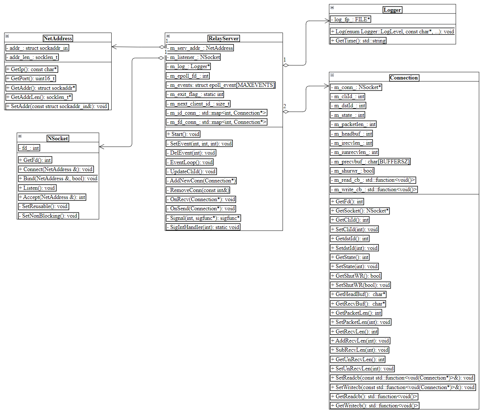
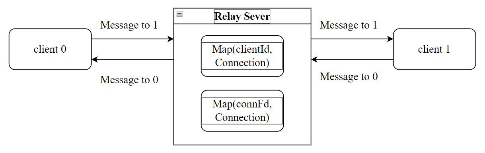
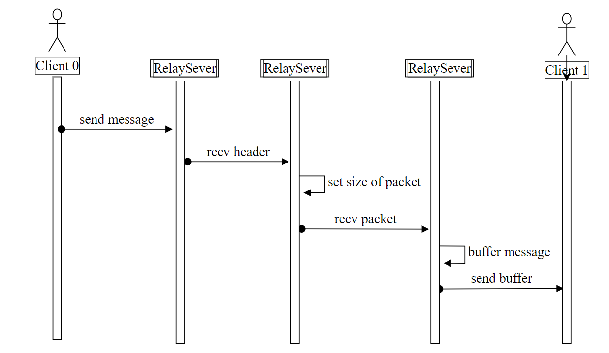
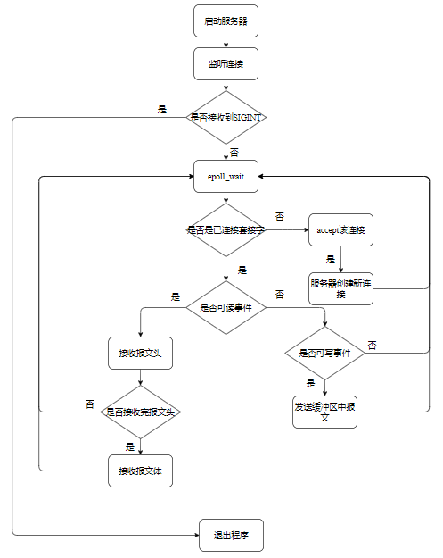
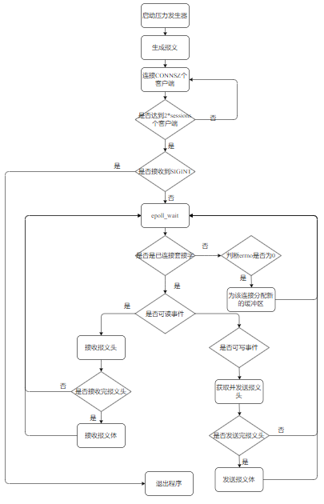

# 网络中继服务器v2

## 实验目标
### 中继服务器
- 两个客户端与服务器相连，然后服务器将要**发送的消息与客户端编号以及对应的可连接文件描述符**记录下来；由服务器进行消息的转发
- 如果此时要发送的客户端并没有连接，抛弃报文，并向发送方发送“对方不存在”的出错报文。 
- 每个客户端连接有个整数ID，ID为n 和ID为n+1（n为偶数）的两个连接为一个会话

- client0、client1与服务器建立连接后，client0向client1发送消息：Server接收消息头部并设置需要接收报文体的长度，继续接收client0的报文体并缓存在Server中；寻找client1的已连接文件描述符，发送缓存的消息并清除Server中的缓存，结束一次发送、接收报文的流程。

### 压力发生器
- 使用非阻塞`connect`进行连接
- 两个客户端之间消息采用同步
  - TODO：对异步消息接收使用流量控制，否则服务器转发速度过慢会让发送客户端发送报文淹没服务器

## 概要设计
### 中继服务器类图

### 压力发生器类图

### 报文设计
#### HeaderInfo
- 客户端之间传递报文的报文头
- `cliId`是客户端自身ID，`len`是发送报文(不包含头部)的大小，`sec`和`nsec`记录报文发送的秒数和纳秒数

~~~c
/*
  报文头信息：仅仅该信息需要网络传输
*/
#pragma pack(1)
struct HeaderInfo {
  uint32_t cliId;  // 客户端编号
  uint32_t len;    // 报文长度(不包括头部)
  uint64_t sec;    /* UTC：秒数 */
  uint64_t nsec;   /* UTC：纳秒数 */
};
#pragma pack()
~~~

### 工作流程

### 时序图

## 详细设计
### 日志类设计
#### Logger
- 日志类，用于记录发生事件
- 提供Log()接口，进行写日志

~~~c++
void Log(enum Logger::LogLevel level, const char *format, ...);
~~~

### 中继服务器设计

##### 服务器工作流程

#### NetAddress类
- 封装IP和端口，并进行错误处理；暂时只支持IPv4地址

#### NSocket类
- 将socket函数进行封装，在类内部进行sockopt相关选项的设置，实现错误处理

#### Connection类
- 保存已连接的fd，内部存在缓冲区对收到的报文进行接收
- 内部包含两个回调函数
  - 读回调：EPOLLIN事件调用
  - 写回调：EPOLLOUT事件调用

~~~c++
std::function<void()> m_read_cb_;
std::function<void()> m_write_cb_;
~~~

#### RelayServer类
- 将Epoll进行封装；同时处理SIGINT信号
- 提供两个回调函数，OnRecv为读回调函数，OnSend为写回调函数
~~~c++
/**
  * @brief clientfd上EPOLLIN事件的回调
  *
  * @param conn
  */
void OnRecv(Connection* conn);
/**
  * @brief clientfd上EPOLLOUT事件的回调
  *
  * @param conn
  */
void OnSend(Connection* conn);
~~~
### 压力发生器设计

#### 压力发生器工作流程

 
#### 用户缓冲区设计
- 存放用户需要发送的报文信息以及从服务器接收到的消息
~~~c++
/*
  压力发生器用户缓冲区
*/
struct ClientBuffer {
  HeaderInfo recv;           // 用户接收报文的头部信息
  HeaderInfo send;           // 用户发送报文的头部信息
  bool head_recv = false;    // 报文头是否接收完毕
  int recvlen = 0;           // 已经接收的报文长度
  int unrecvlen = HEADERSZ;  // 未接收的报文长度
  char buffer[BUFFERSZ];     // 报文缓冲区
  char* sendpackets;         // 发送的报文
  int sendlen = 0;           // 发送的报文长度
};
/*
  客户端信息
*/
struct ClientInfo {
  int connfd;
  int state{-1};  // -1: 未连接 0: 已连接 1: 已经写入报文 2：已经读取报文
  ClientBuffer* buffer{nullptr};
};
~~~

#### 事件处理设计
- 使用epoll来管理IO事件，为避免发送方数据过多淹没服务器，这里采用同步消息发送；
- TODO：使用异步消息发送，采用流量控制防止发送方发送过多数据
- 在消息头部记录发送时间，方便压力发生器对报文延时进行计算

~~~c++
uint64_t g_recvPackets{0};    // 收到到报文数量
uint64_t g_sendPackets{0};    // 发送的报文数量
double g_totalDelay{0};       // 总延迟
double g_averageDelay{0};     // 报文平均延迟
struct timespec g_startTime;  // 压力测试开始时间
struct timespec g_endTime;    // SIGINT接收时间
~~~